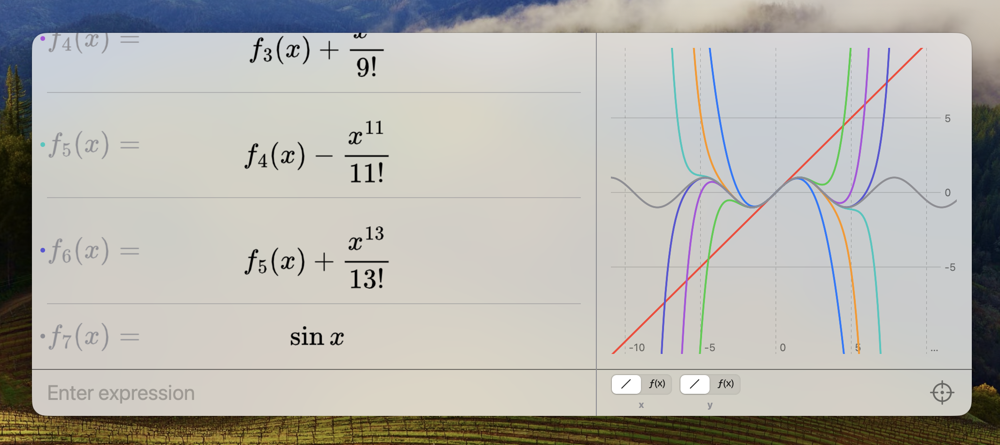

# SpotCalc
### A Desmos-like graphing calculator 

*Still a WIP*

**Features:**
- Function and variable definitions
- LaTeX rendering
- Custom parser with standard + pythonic syntax
- Uses [Accelerate](https://developer.apple.com/documentation/accelerate) for faster graph rendering on apple silicon
- Spotlight-like floating window for quick usage

**To be added:**
- Matrix operations
- 3D graphing
